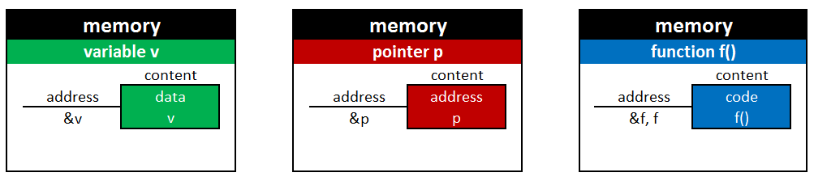
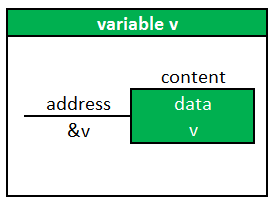
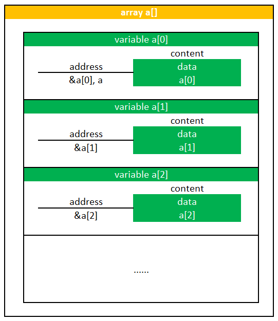
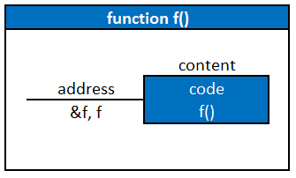
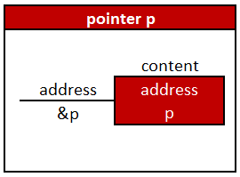
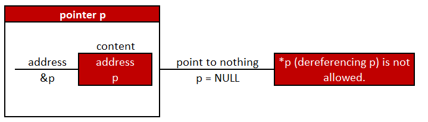
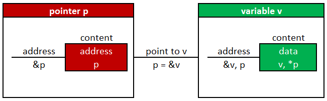
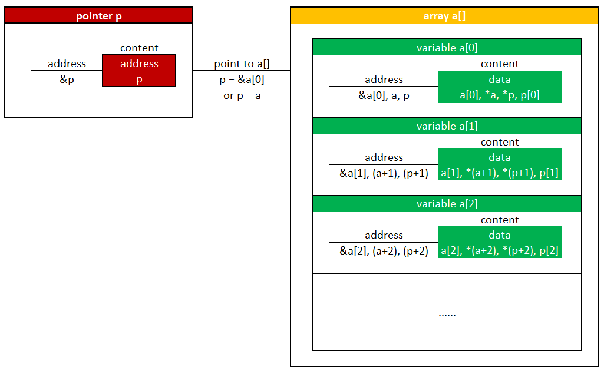
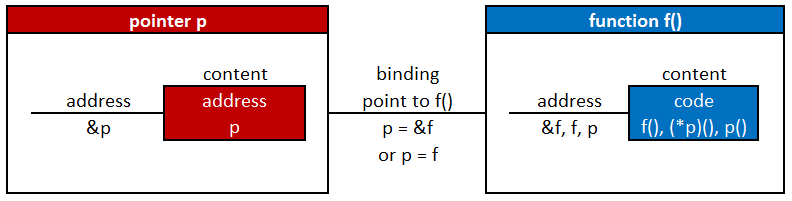
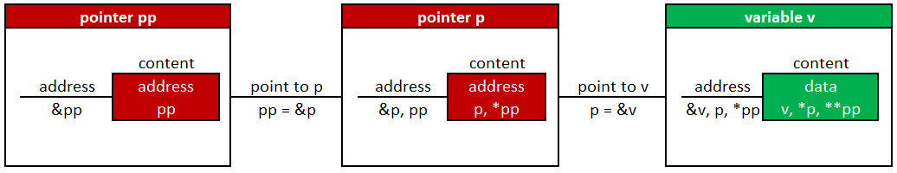

# Memory Address and Content

Memory is used to store data, address, and code.

* data: variable, array, structure, string, ... 
* address: pointer which points to data or functions
* code: function

## Variable

If ``v`` is a normal variable, ``&v`` is the address of v and ``v`` is the content of v.

* ``&v`` is fixed.
* ``v`` is changeable.
* It's obvious that ``&v`` and ``v`` are different.
* It's confusing that ``v`` is the name of a variable and its content.

## Data - Array

If a[i] is a variable in an array ``a[]``, ``&a[i]`` is the address of a[i] and ``a[i]`` is the content of a[i].

* ``a[i]`` is a variable. ``&a[i]`` is its address, and ``a[i]`` is its content.
* ``a`` is also the address of a[0], so ``a`` and ``&a[0]`` can be used interchangeably.
* However, it is convenient but confusing if we use ``a`` instead of ``&a[0]``. 
* When coding, there is a trade-off between ``a`` and ``&a[]``
  - ``&a[]``: logical, easy to understand
  - ``a``: simple, compact, and concise, but confusing

  
## Code - Function

If ``f()`` is a function, ``&f`` is the address of f(), and the content of f() is code.

* It's confusing that both `f` and ``&f`` are the address of f().

## Address - Pointer

If ``p`` is a pointer variable, ``&p`` is the address of p and ``p`` is the content of p.

* both a normal variable and a pointer variable are variables.
* the difference between a normal variable ``v`` and a pointer variable ``p`` is that ``p`` needs a target.
* ``p`` is the address of the target. ``*p`` is the content of the target
* ``&p`` is fixed, ``p`` is changeable, and ``*p`` is changeable.

## Pointer to Nothing

## Pointer to Variable

## Pointer to Array

## Pointer to Function

## Pointer to Pointer to Variable

