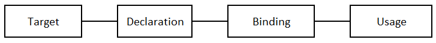

# Workflow



Follow the workflow when using a pointer.

1. Target - a useful pointer must points to a target
1. Declaration - data type must be consistant between a pointer and its target
1. Binding - connecting a poniter and a target by assigning the address of a target to a pointer
1. Usage - using `*p` to access a target of a pointer `p`

## Target

A pointer without a target is useless, so begin with the target in mind. 
A target of a pointer could be a variable, an array, a function, another pointer, etc.


Declare a target `t` which will be accessed by a pointer.

```
data_type t; 
```

## Declaration

Declare a pointer `p` where data type of `t` and `*p` must be consistent.

```
data_type *p; 
```

## Binding

Connecting a poniter `p` and a target `t` by assigning the address of a target `&t` to `p`.


```
p = &t;
```

## Usage

Dereferencing pointer `*p` to access `t`.


# Examples

## Point to Variable

### Point to Char

Use a pointer `p` to set a char variable `v` to `'A'`.

#### Target

The target is a char variable `v`.

```
char v; // data_type of v is char.
```


#### Declaration
```
char *p; // data_type of v and *p is char where v is a variable and p is a pointer.
```

#### Binding
```
p = &v; // `p` points to `v`
```


#### Usage

```
*p = 'A'; // same as v = 'A'
```

### Put it together

```
// set v to 'A'
char v, *p;
p = &v;
*p = 'A';
```


## Point to Array

### Point to an Array of Integers

Use a pointer `p` to access an array a[].

#### Target

The target is an array of integers.

```
int a[] = {0, 10, 2, 3, 4, 5}; // a is array name, a[0], a[1], ... are integer variables
```


#### Declaration
```
int *p;
```

#### Binding
```
p = a; // assign array name to a pointer. same as p = &a[0]
```


#### Usage

Set a[0] to 10.
```
*p = 10; // same as p[0]=10
```

Set a[2] to 32.
```
*(p+2) = 32; // same as p[2]=32
```

### Put it together

```
// set a[0] to 10, and a[2] to 32
int *p, a[] = {0, 10, 2, 3, 4, 5};
p = a;
*p = 10;
*(p+2) = 32;
```


## Point to Pointer


### Point to a Char Pointer

Use a pointer `pp` to set a char variable `v` to `'A'`.

#### Target

The target is a char variable `v`.

```
char v, *p; // data_type of v and *p is char.
```


#### Declaration
```
char **pp; // pp is a pointer and data type of **pp is char
```

#### Binding
```
p = &v; //`p` points to `v`
pp = &p; // `pp` points to `p`
```


#### Usage

```
**pp = 'A'; // same as v = 'A' and *p = `A`
```

### Put it together

```
// set v to 'A'
char **pp, *p, v;
p = &v;
pp = &p;
**pp = 'A'; // set v to 'A'
```


## Point to Function

### Point to a Function which Returns an Integer

Use a pointer `p` to call a function `f()`.


#### Target

The target is a function `f()` which returns an integer.
```
int f();
```

#### Declaration


```
int (*p)(); // p is a function pointer. calling the function `(*p)()` returns an integer.
```


#### Binding
```
p = f; // assign function name to a function pointer, same as p = &f
```


#### Usage
```
(*p)(); // call function f()
```

### Put it together

```
// call function f()
int (*p)(), f();
p = f;
(*p)();
```


# Appendix A

Priority of operators in ascending order

* `()` `[]` `.` `->`  
* `*` `&` `++` `--`  
* `+` `-`  
* `=` `+=` `-=`


# Appendix B

Function pointer vs function name
```
int h(); // h is function name. Calling h() returns an integer.
int (*h)(); // h is a function pointer. Calling function (*p)() will return an integer.
int *h(); // h is function name. Calling h() returns an integer pointer
int *(*h)(); // h is a function pointer. Calling (*h)() returns an integer pointer
```
